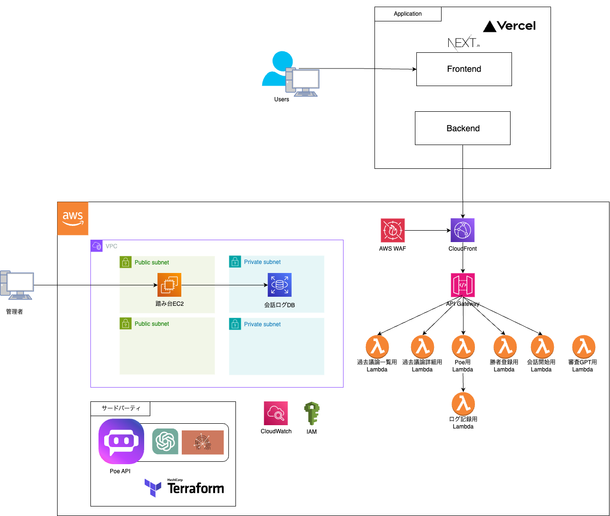
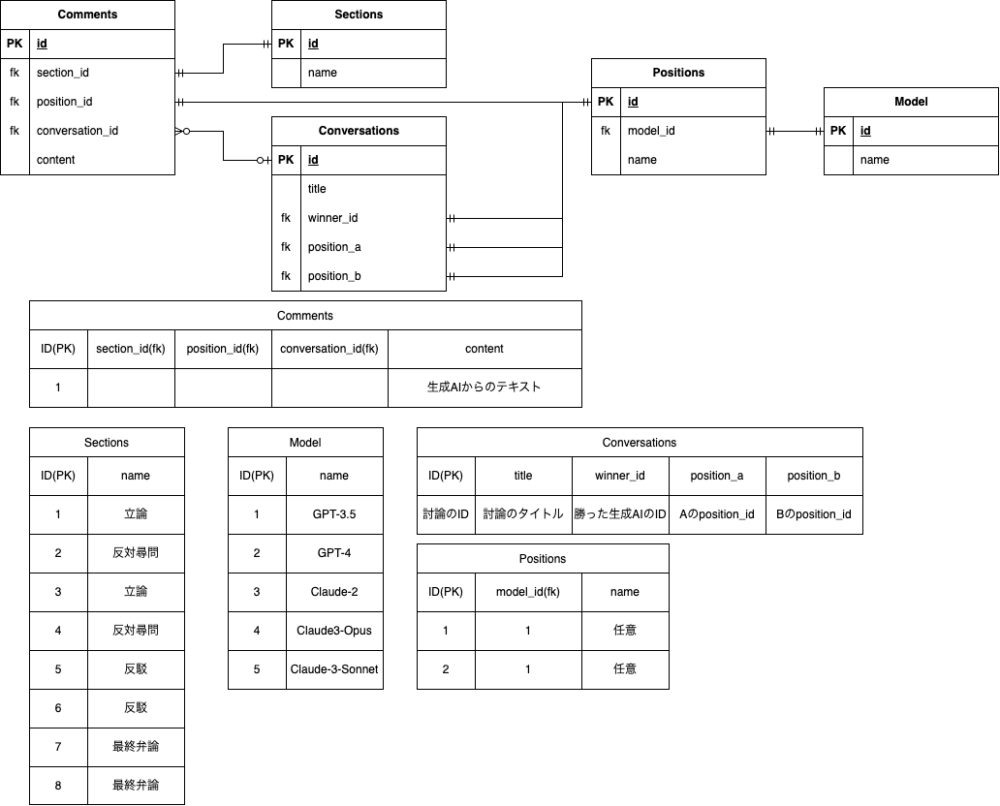

# Hackit_team07
2024/3/2~3/19
### ArgutAI
ArgutAI((アーギュテーアイ)
ラテン語で「鋭い議論」を意味する"argutia"とAIを掛け合わせました．

### Hackit
https://kit-hackit.notion.site/Hackit2-Challenge-c34eb7ba24a2484288b3404584367065?pvs=74

## チーム名
タイポ戦隊

## アイデアソン
https://docs.google.com/document/d/1IlEeJMFgx2W9Uz2Yu6vKjD8kF3H9yP0FQnp9-vPuuWM/edit?usp=sharing

## 最終発表
[最終発表スライド](https://github.com/Sakauchi444/argut_ai/blob/main/docs/slide/%E3%82%BF%E3%82%A4%E3%83%9D%E6%88%A6%E9%9A%8A_%E6%9C%80%E7%B5%82%E6%88%90%E6%9E%9C%E7%99%BA%E8%A1%A8.pdf)

## アーキテクチャ

## データベース

## deloy
Render

## 成果
- わかば賞(コミットした数が一番多いで賞...）
